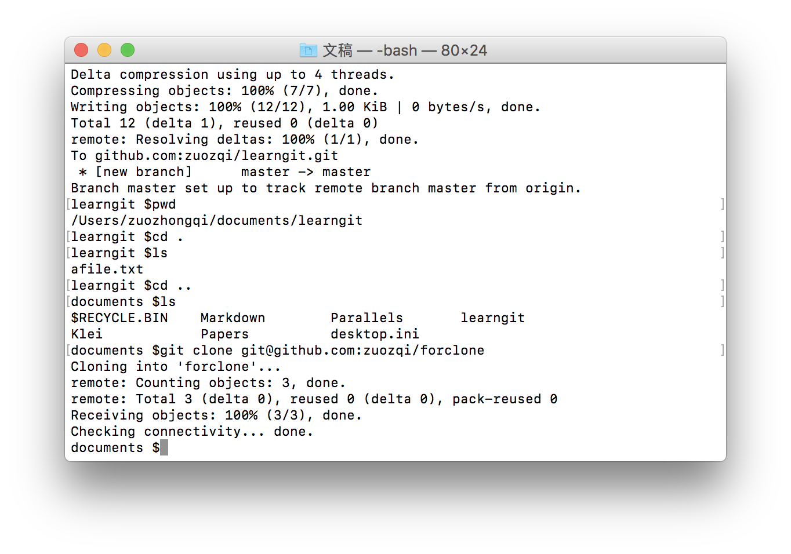
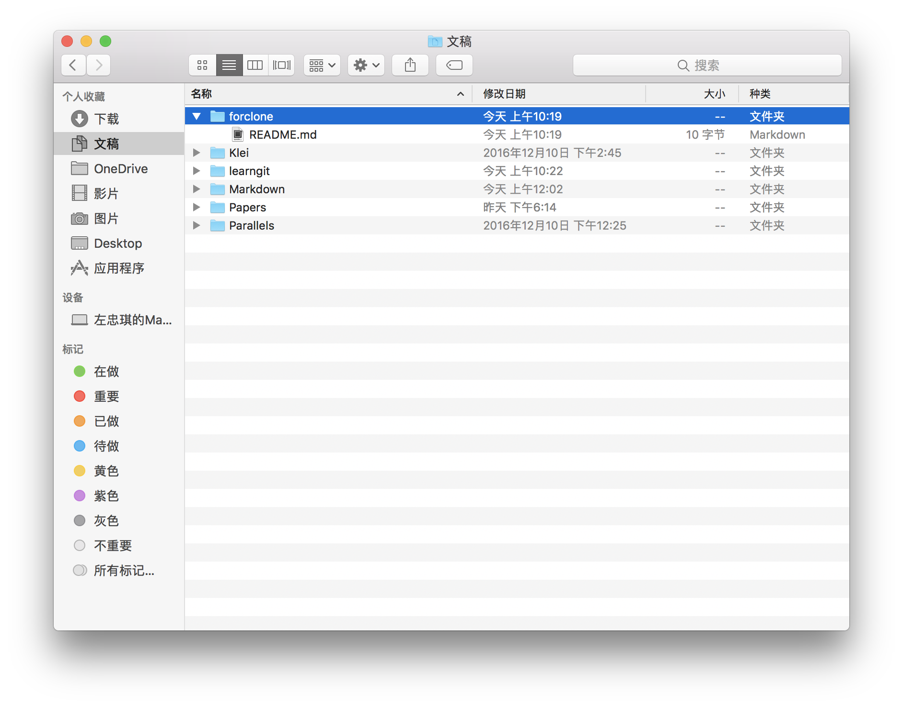
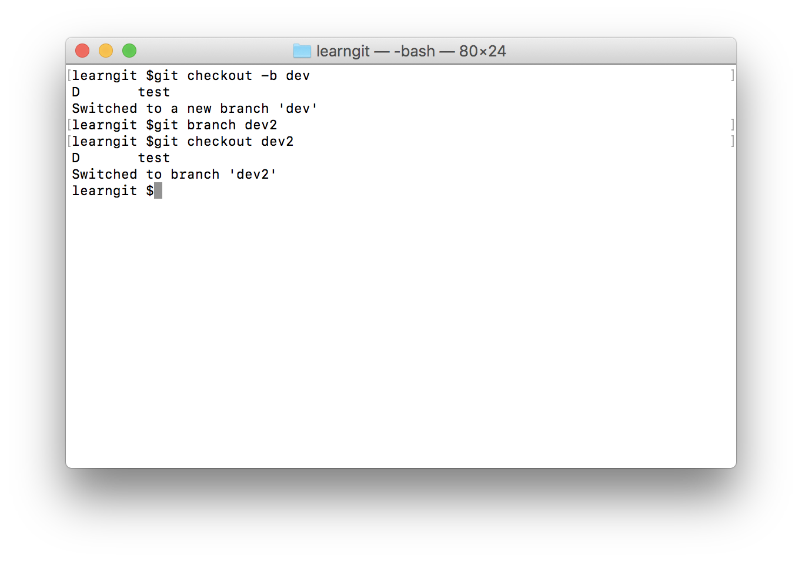
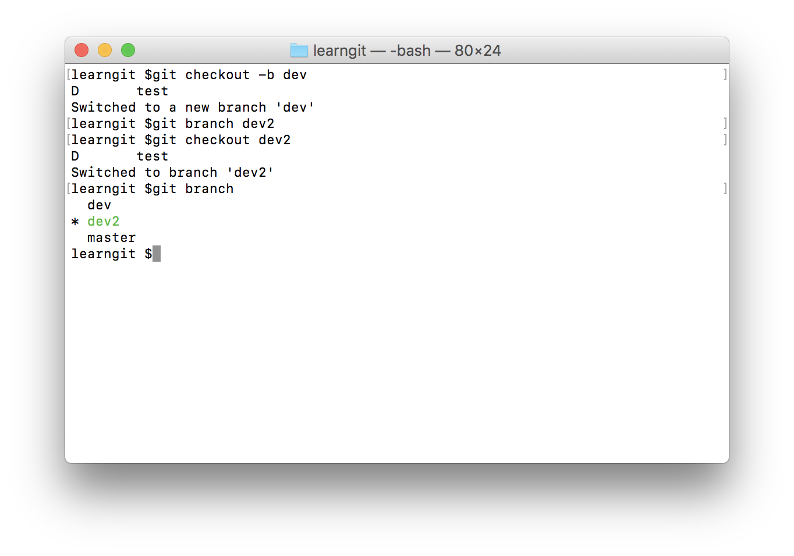
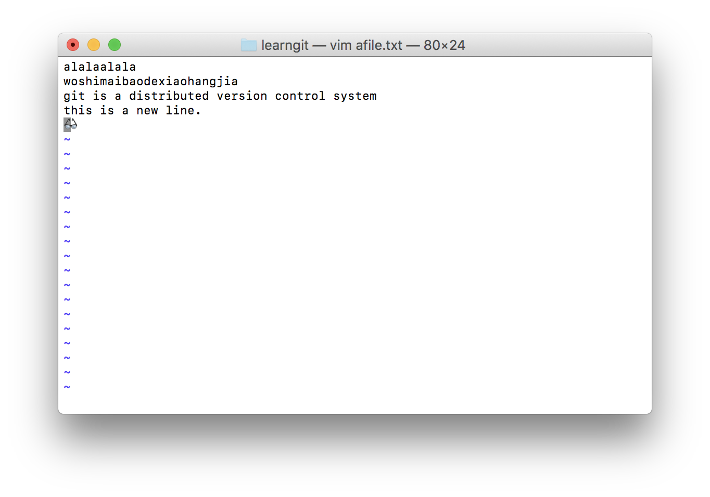
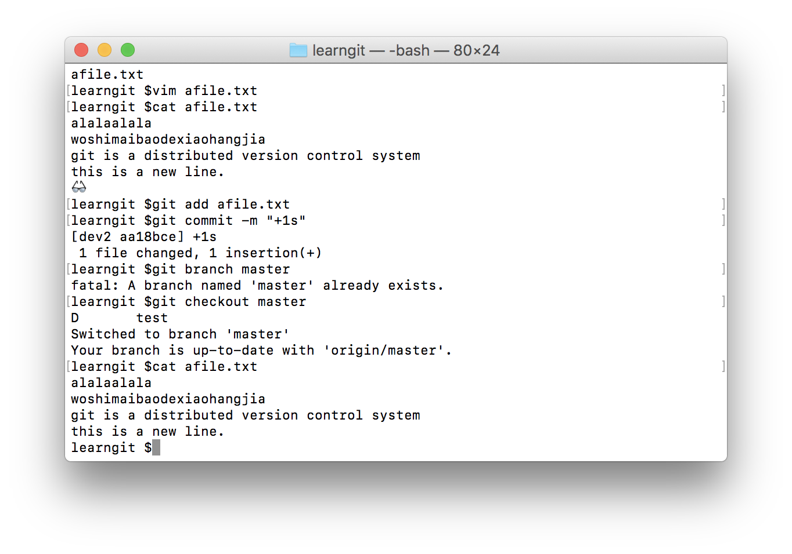

git分布式版本管理
===

source：
[git教程](http://www.liaoxuefeng.com/wiki/0013739516305929606dd18361248578c67b8067c8c017b000/0013743256916071d599b3aed534aaab22a0db6c4e07fd0000)


创建工作目录
---

在一个合适的目录

```
$ mkdir learngit
$ cd learngit
$ pwd
/Users/michael/learngit
```

然后通过`git init`命令就可以把当前目录转变为git目录，将由git统一管理，如果没有姿势千万不要自己乱修改。在文件夹中会生成`.git`的隐藏文件，可以通过`ls -ah`查看。

需要提出的是：版本管理软件可以管理的都是文本文件，即，对于类似word的二进制文件，和视频或音频的编码的文件，只能知道改变了，但并不能追踪文件的变化。文本文件包括，代码，网页，txt，或者.md文件。文本的编码建议用UTF-8编码。

创建一个文件
---
下面的步骤为在git目录中添加一个文件。

```git
git add afile
```

上面的命令将在之前的目录中添加文件。(注意，文件应该之前就已经被创建好）
接着可以提交这次修改

```git
git commit -m "What have I done?"
```
这里`-m`命令是对这次提交的说明。
值得注意的是，commit是对这一阶段的修改的提交，即可以一次创建多个文件然后提交，如下
```git
$ git add file1.txt
$ git add file2.txt file3.txt
$ git commit -m "add 3 files."
```

修改一个文件
---

在修改一个文件后，通过`git status`命令查看文件夹内文件的状态，即那个文件被修改过。而如果需要查看具体修改了哪些内容的话，则需要`git diff afile`命令查看。diff命令会给出两个文件前后的对比。


回溯一个文件
---
每当工作到一段落的时候，都可以保存一下，即commit一下，这样，有时候会因为记不得做过哪些修改而无从下手，这时候可以用

```
git log
```
命令来获得之前的修改和说明

%：前面一大堆是commit id
当前的版本是`HEAD`,上一个版本是`HEAD^`,上上个版本是`HEAD^^`,前100个版本是`HEAD~100`，这样，输入这个命令：

```
git reset --hard HEAD^
```
就可以进行回滚了～
这样会重置log，当后悔了的时候，可以在reset后面加id号，id可以通过`git reflog`查看，id不必要写全，能区分就可以。

Git缓存区的概念
---

在Git中，库文件里隐藏的`.git`文件里面有很多文件，其中比较重要的一个就是`stage`文件和`HEAD`文件。

`stage`文件为缓存区，即add过的文件会在这里做为缓存，在status的时候这里是staged下面的东西。

`HEAD`文件是一个指针，在commit的时候就会把所有的修改提交到当前的分支里。默认的系统创建的第一个分支为`master`.

注意：如果修改一次，add，修改第二次，commit，这时提交的只是第一次的修改，commit只针对缓存区里的内容。

撤销修改
---

如果手贱写了一大堆没用的内容，还没有add过的话，可以用命令

```
git checkout -- afile
```
这个命令的作用是，回到上一次`commit`或者`add`的版本，即

- 如果文件还没有被添加到暂存区，则回到上一个版本库的样子
- 如果文件在被提交到暂存区之后修改，则回到暂存区的样子

如果已经把错误的内容提交到add里了，则可以用

```
git reset HEAD afile
```
即回到最新版本的库里的afile文件的内容。

如果已经删除一个文件的话，用`status`命令查看会显示被删除的文件，这时候必须做出选择

- 如果确实要删除的话，用`git rm test`命令
- 如果需要恢复的话，用`git checkout -- test`命令

远程库
---
注册`github`，添加ssh_pub。
因为之前已经做过，详见之前的参考网站。

在`github`中建立一个同名的repo，然后默认选项，在本地通过

添加远程库
---

```
git remote add origin git@github.com:zuozqi/learngit
```
命令来添加两个库（本地，远程）的关联。注意：第一次添加`ssh`会验证`github`的密钥，yes就可以（或者也可以真的验证一下），这里`origin`自然而然的联想到是远程库的代词。

连接好了之后，就可以通过

```
git push -u origin master
```
命令来把本地的修改上传到远程，`push`即推送，`u`关联本地和远程的分支，仅第一次用就可以，后面的指push到origin的master分支。

这时可以看到远程的库和本地库内容就一样了，而且git的一个优点就是，不需要联网。即，本地如果没联网也可以进行工作，等有网或者有心情的时候push一下就可以了。

以后想push的时候

```
git push origin master
```
命令就可以将本地的库推送到远端的库。

克隆远程库
---

这时候就有一个疑问，把库推送到远程是可以理解的，但这是同步的意思么？并不是的。同步就有一个问题，以谁为基准，在之前使用各种软件的同步问题的时候都有这个问题。推送意味着，以本地为基准，将远程更新为本地的库，而反过来就需要克隆命令。

这里在`github`建立一个新的repo，姑且命名为`forclone`，并勾选`initialize with README`选项，这样在`github`就会初始化一个帮助文档。

在本地gi
```
git clone git@github.com:zuozqi/forclone
```


这样，在本地就有了一个`forclone`的备份，在团队协作中可以每个人先clone一份原始文稿到本地，然后push到远端。



需要clone最重要的就是知道库的地址

注意：`github`支持`http`和`ssh`传输，不过`http`比较慢还需要验证

分支管理
---

在上面介绍的团队合作中，有几个显而易见的问题，比如，如果我手头上的工作做了一半，还没有形成可读的正式文件，我该不该推送？又比如，一个团队中有很多人，每个人的修改都是同时的，是大家都推送到一个repo还是最后再汇总？该如何汇总？

分支的概念就可以解决这个问题。（下面概念图摘取自参考网站）

在github中，分支其实使用指针来完成的，在前面的回溯版本的时候，也用到了`HEAD`，当时提出的`HEAD`就是指向提交，但其实`HEAD`并不严格指向提交，`HEAD`指向的是「当前分支」，只是因为当时只有master分支，只能提交`master`，所以等同于指向提交。


而当新建一个分支的时候，系统引入一个新的指针`dev`，仅仅是个指针而已，然后新的分支就创建完了，再把`HEAD`指向`dev`，这样，当前工作的分支就转到`dev`上了


而当作出改动时，新`commit`的版本会有`dev`指向，如图中红色的连线，这样，新的修改在保存或者`push`的时候，会存放在新的`dev`分支里。


而当这一阶段的工作做完以后，评估可以将这一阶段的工作汇总到 **自己** 的工作进程里，只需要将`master`指针指向`dev`，这样也就完成了合并，如图中所示，文件修改的log也被同步到了`master`指针里。


更甚之，为了库的简洁，可以将`dev`指针删除，这样工作目录就只有一个指针，即分支了。这样并看不出来曾经存在过分支（工作中不确定的结果）


下面是具体的操作

```
git checkout -b dev
```
前面介绍的`checkout`命令是撤销修改用的，它还可以用不同的参数管理分支，这个命令相当于下面两个命令
```
git branch dev
git checkout dev
```


然后可以通过`git branch`命令查看分支，这个命令会列出当前库中所有的分支，并在当前分支前加`*`



可以看见我们正处在`dev2`的时间线上，下面尝试一下修改文件，比如我们在`afile.txt`里画一个黑框眼镜👓。



然后提交当前工作（本地）。
然后切换到`master`分支，再查看文件。



可以看到！我们进行的+1s操作在`master`分支没有保存（看来已经被笑纳了👀

需要合并的时候，使用

```
git merge dev2
```
将`dev2`合并到当前分支。
然后删除`dev2`分支

```
git branch -d dev2
```
这样，之前做过的工作就被调整到了`master`分支。

冲突解决
---

在之前的操作中，先建立分支，然后在分支中操作，之后合并分支。这时把分支中的内容增加到另一个分支中。可是如果在`master`分支中已经做过了修改，这时就会出现冲突。因为不仅仅是把另外分支的加进来，而是`master`中有着`dev`中加不进来的内容。

解决方法是在提示合并失败的时候，用`status`查看冲突的文件，再去文件内修改，文件内会标注冲突的段落。手动删去或修改冲突的内容。

使用`git log --graphic`可以看到分支演化图。


在实际使用中，`master`分支应该是非常稳定的，`dev`可作为工作的分支，每个人都在`dev`下更新，如下图所示。


在合并过程中可以用`--no-ff`参数来保存分支合并记录，并添加描述


多人协作
---

通过一个例子说明协作的过程。

>假定你和你的小伙伴需要共同对“低温等离子体论文管理”这个文件夹里的文件进行操作（当然，两个ssh文件都要在账号设置里）。他提交了一份“我觉得好的论文.txt"并推送了，碰巧的是，你也想上传一个文件也叫“我觉得好的论文.txt"。

这时问题主要有：

- 你本地的版本是落后于远程的版本的
- 文件的内容不一致（conflict）

所以一步步解决为：

1. 使用`git pull`，将远程的和本地的同步
	注意：应该提前设置好对应关系，就像最开始建立的时候用了`-u`命令一样，后面可以用`git branch --set-upstream dev origin/dev`（默认工作分支为dev)建立
	
	 %教程中为`--setupstream`,不过据说更新了为 `--track` 或 `--set-upstream-to`,这里没条件测试，待查。%
2. 在本例中出现的冲突，也需要在完成后手动在冲突文件上解决。解决冲突（也可以先回滚，再修改？）后再`push`到远端。

所以多人合作的一般步骤为

1. 完成工作后向远端`push`。
2. 如果不能`push`，说明远端的版本比你的新，需要pull合并之后再push。
3. 如果有两个人同时（在两次`pull`之间）对同一个文件进行了更新，就会冲突，解决冲突之后再`push`。
	（所以尽量不要存在同名文件）
	
一些提高幸福感的小技巧
---

- tag功能

  前面提到的`commit id`初见就会觉得非常麻烦，事实上，为了避免重复，这样做是有必要的，但是实现起来却是缺少了灵活性。`git`提供了一种给「历史版本」加标签的方法，使用场景为，比如说想要回到确定的“2016年10月”这个版本，则可以直接在当时加标签，想要回到当时的版本使用`git reset 2016.10` 命令将当前分支回到2016年10月。可以使用`-m`参数添加描述
  
  使用`git tag`可以列出所有的标签
  
  可以使用`git tag -d 2016.10`删除标签
  
  标签默认存放在本地，不会自动同步到远程，可以通过
  
  ```
  git push origin 2016.10
  ```
  实现，也可以通过
  ```
  git push origin --tags
  ```
  推送所有没推送的标签。
  
  _但是——_，标签在远端删除很麻烦，需要先在本地删除，再在远端删除，代码为：
  
  ```
 git tag -d 2016.10
 git push origin :refs/tags/2016.10
 ```
 所以需谨慎
 
- `github`的`fork`功能

   前面提到了`github`中多个人可以对一个分支`push`，这时必须要将密钥（本地主机）添加到`github`账户里的信任列表，这样在开源时就存在安全问题。
   
   另一个解决方法是，在别人的`GitHub`里的`repo`点`fork`，这样，自己的账号里就有了一份一样的复制。关系如下
   


(图中是从`twbs`账号的`bootstrap`项目里`fork`到了`my`账号里，然后从`my`的远端同步到自己的主机（local）

这样，自己就可以随意的对项目进行修改了，而想要对官方的（即twbs账号）进行修改的时候，只需要在`GitHub`中发起一个`pull request`，`twbs`账号的主人可以决定是不是要把你的内容接收。
